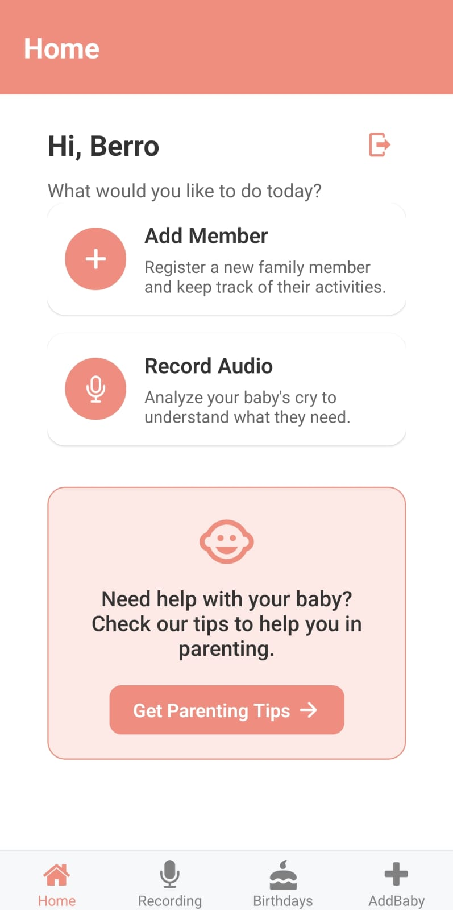

<br><br>

<!-- project philosophy -->


> A mobile app for understanding a baby’s needs by interpreting their cries, making it easier for parents to respond promptly and effectively.
>
> BabyEcho aims to bridge the communication gap between parents and their infants by providing precise insights into what a baby's cries signify. We believe in enhancing the parenting experience by reducing anxiety and ensuring confidence in addressing a baby’s needs.


### User Stories
- As a user, I want to know what my baby needs, so I can respond promptly and effectively.
- As a user, I want to receive notifications when my baby cries, so I can be alerted immediately.
- As a user, I want to track my baby’s cry patterns, so I can understand their needs better over time.

### Doctor Stories
- As a doctor, I want to access the baby's data, so I can monitor the baby's health and well-being remotely.
- As a doctor, I want to view charts that analyze the baby's cry patterns and other data, so I can make data-driven decisions and offer informed medical advice.
- As a doctor, I want to securely download or export baby analysis data, so I can include it in medical records or share it with other healthcare professionals.

<br><br>

<!-- Tech stack -->


### BabyEcho is built using the following technologies:

- This project uses the React Native framework, a cross-platform mobile development framework, allowing us to develop the app for both iOS and Android from a single codebase. For state management, the app utilizes Redux, providing a predictable state container for managing application state, including user sessions, baby monitoring data, and notifications.

- For persistent storage, the app uses MongoDB, a NoSQL database that efficiently manages baby data, cry analysis sessions, and progress tracking. Cry pattern analysis is powered by FastAPI, a modern Python-based web framework that integrates machine learning models to assess and provide real-time feedback on the baby's cry.

- 🚨 Node.js and Express.js are used to manage backend functionalities, including user authentication, session tracking, and interactions with AI models for cry pattern analysis. The app integrates with IoT devices (ESP8266) for real-time monitoring and control, enhancing baby monitoring capabilities.

- User audio files and other assets are securely stored in AWS S3, ensuring scalable and reliable file storage for the application.

<br><br>

<!-- UI UX -->


> We designed BabyEcho using wireframes and mockups, iterating on the design until we reached the ideal layout for easy navigation and a seamless user experience.

- Project Figma design [figma](https://www.figma.com/design/iS9bgbQR8TiNToHSQ8DhFZ/Baby-Echo?node-id=0-1&t=tngZIMDuohP5a06X-1)

<br/><br/>

### Mockups

| Home Screen | Birthdays Screen |
| ---| ---| 
|  |  |

<br/><br/>
<!-- Database Design -->


### Architecting Data Excellence: Innovative Database Design Strategies:


<br><br>


### User Screens (Mobile)

| Login screen  | Register screen | Add Baby screen |
| ---| ---| ---|
|  |  |  |

| Tips Screen | Baby Recordings screen  | Recording Screen  |
| ---| ---| ---|
|  |  |  |


<br/></br>


<!-- AWS Deployment -->


### Efficient AI Deployment: Unleashing the Potential with AWS Integration:

- BabyEcho utilizes AWS deployment strategies to efficiently integrate and deploy machine learning models for real-time cry pattern analysis. With a focus on scalability, reliability, and secure storage, we ensure that the app delivers accurate and responsive insights to parents, no matter the volume of data or user demand.


<br><br>


<!-- Unit Testing -->


### Precision in Development: Harnessing the Power of Unit Testing:

- This project employs rigorous unit testing methodologies to ensure the reliability and accuracy of code components. By systematically evaluating individual units of the software, we guarantee a robust foundation, identifying and addressing potential issues early in the development process.


<br><br>


<!-- How to run -->


> To set up VerbalBotic locally, follow these steps:

### Prerequisites

This is an example of how to list things you need to use the software and how to install them.

- npm
  ```sh
  npm install npm@latest -g
  ```


### Installation

_Below is an example of how you can instruct your audience on installing and setting up your app. This template doesn't rely on any external dependencies or services._

1. Clone the repo:

   ```sh
   git clone [github](https://github.com/houssein-berro/BabyEcho.git)
   ```

2. Create a `.env` file in the backend with the following environment variables:

   ```js
   MONGO_URI = "ENTER YOUR MongoDB URI";
   JWT_SECRET = "ENTER YOUR secret";
   PORT = "ENTER the port for your backend";
   ```

3. Create a `.env` file in the mobile with the following environment variables:

   ```js
   API_URL = "http://yourBackendIP:yourBackendPort";
   ML_URL = "http://yourMLServerIP:yourMLServerPort";
   ```

4. Install NPM packages:

   ```sh
   cd BabyEcho-backend
   npm i
   npm run dev # to run the backend, port is declared in the .env file
   ```

   ```sh
   # new terminal
   cd BabyEcho-ml
   uvicorn app:app --host 0.0.0.0 --port "desired port"
   ```

   ```sh
   # new terminal
   cd BabyEcho-mobile
   npm i
   npx react-native start --clear
   ```

5. Ensure your ESP8266 is set up and connected to the backend for real-time cry pattern monitoring and control.

Now, you should be able to run **BabyEcho** locally and explore its features.
