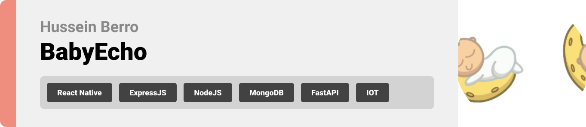

  

<!-- project philosophy -->

> A web app for understanding a baby’s needs by interpreting their cries, making it easier for parents to respond promptly and effectively.
>
> BabyEcho aims to bridge the communication gap between parents and their infants by providing precise insights into what a baby's cries signify. We believe in enhancing the parenting experience by reducing anxiety and ensuring confidence in addressing a baby’s needs.

### User Stories
- As a user, I want to know what my baby needs, so I can respond promptly and effectively.
- As a user, I want to receive notifications when my baby cries, so I can be alerted immediately.
- As a user, I want to track my baby’s cry patterns, so I can understand their needs better over time.
