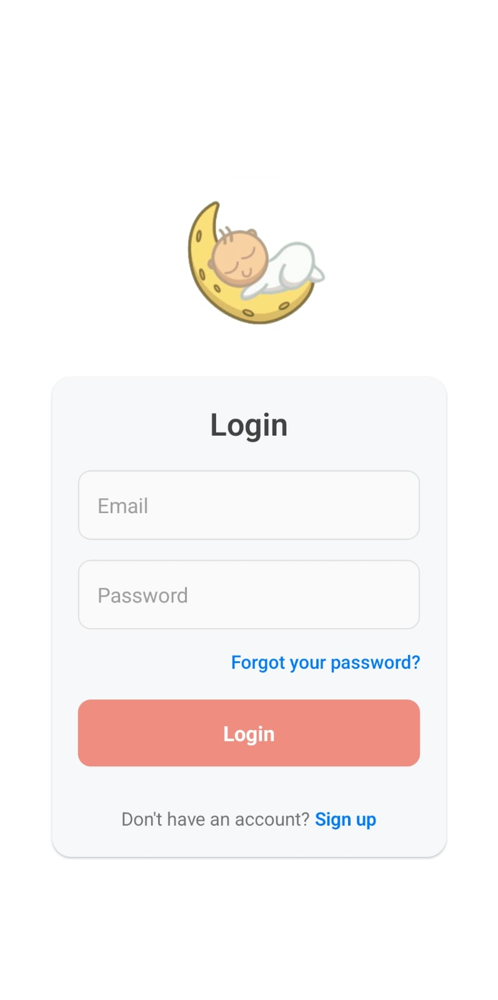
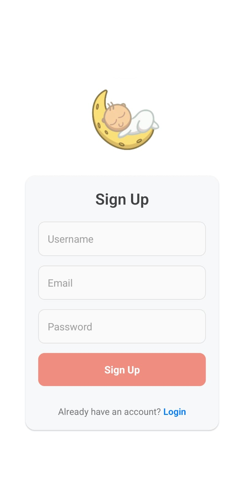
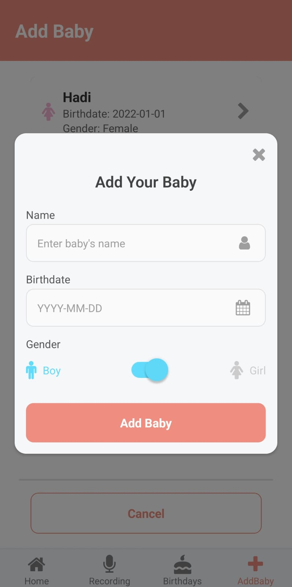
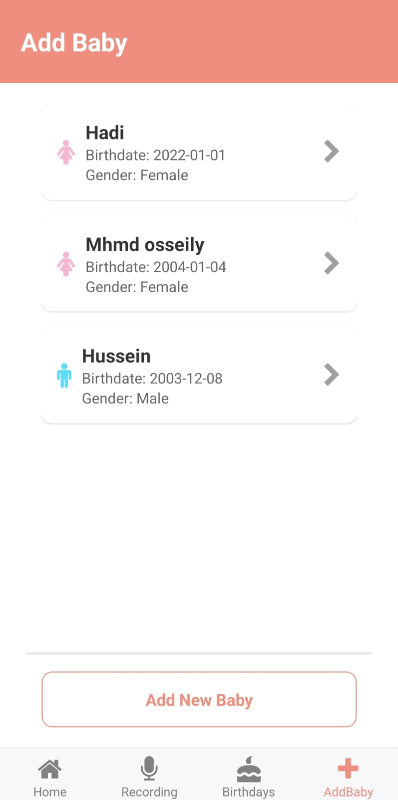
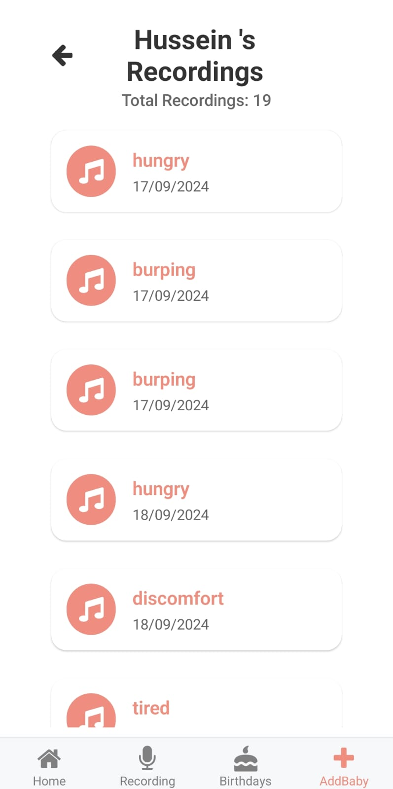
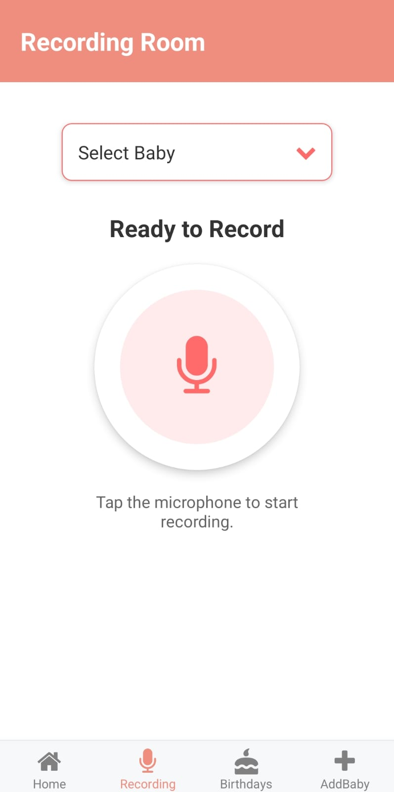
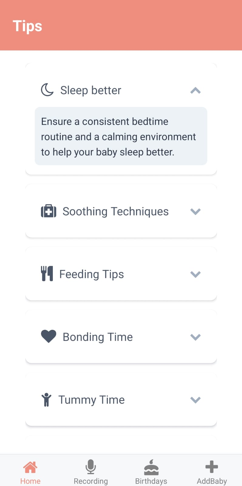

  

<!-- project philosophy -->

> A mobile app for understanding a baby’s needs by interpreting their cries, making it easier for parents to respond promptly and effectively.
>
> BabyEcho aims to bridge the communication gap between parents and their infants by providing precise insights into what a baby's cries signify. We believe in enhancing the parenting experience by reducing anxiety and ensuring confidence in addressing a baby’s needs.

### User Stories
- As a user, I want to know what my baby needs, so I can respond promptly and effectively.
- As a user, I want to receive notifications when my baby cries, so I can be alerted immediately.
- As a user, I want to track my baby’s cry patterns, so I can understand their needs better over time.

  

<!-- Tech stack -->

### BabyEcho is built using the following technologies:

- This project uses the React Native framework, a cross-platform mobile development framework, allowing us to develop the app for both iOS and Android from a single codebase. For state management, the app utilizes Redux, providing a predictable state container for managing application state, including user sessions, baby monitoring data, and notifications.

- For persistent storage, the app uses MongoDB, a NoSQL database that efficiently manages baby data, cry analysis sessions, and progress tracking. Cry pattern analysis is powered by FastAPI, a modern Python-based web framework that integrates machine learning models to assess and provide real-time feedback on the baby's cry.

- 🚨 Node.js and Express.js are used to manage backend functionalities, including user authentication, session tracking, and interactions with AI models for cry pattern analysis. The app integrates with IoT devices (ESP8266) for real-time monitoring and control, enhancing baby monitoring capabilities.

- User audio files and other assets are securely stored in AWS S3, ensuring scalable and reliable file storage for the application.

  

<!-- UI UX -->

> We designed BabyEcho using wireframes and mockups, iterating on the design until we reached the ideal layout for easy navigation and a seamless user experience.

- Project Figma design [figma](https://www.figma.com/design/iS9bgbQR8TiNToHSQ8DhFZ/Baby-Echo?node-id=0-1&t=tngZIMDuohP5a06X-1)

  

### Mockups

| Home Screen | Birthdays Screen |

|  |  |

  
<!-- Database Design -->

### Architecting Data Excellence: Innovative Database Design Strategies:
- Insert ER Diagram here

  

### User Screens (Mobile)

| Login screen  | Register screen | Add Baby screen | Babies screen |
| ---| ---| ---| ---|
|  |  |   |  |
| Baby Recordings screen  | Recording Screen  | Tips Screen |
|  |   |  

  

